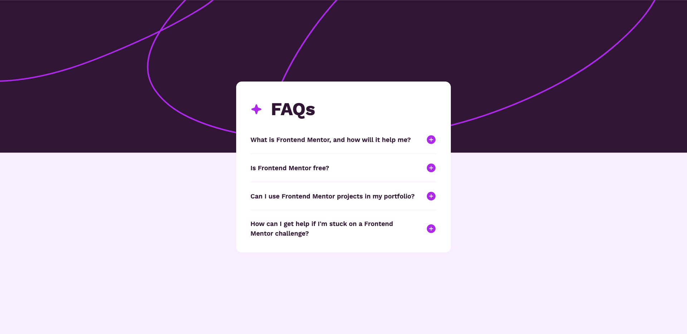

# Frontend Mentor - FAQ accordion solution

This is a solution to the [FAQ accordion challenge on Frontend Mentor](https://www.frontendmentor.io/challenges/faq-accordion-wyfFdeBwBz). Frontend Mentor challenges help you improve your coding skills by building realistic projects. 

## Table of contents

- [Overview](#overview)
  - [The challenge](#the-challenge)
  - [Screenshot](#screenshot)
  - [Links](#links)
- [My process](#my-process)
  - [Built with](#built-with)
  - [What I learned](#what-i-learned)
  - [Continued development](#continued-development)
  - [Useful resources](#useful-resources)
- [Author](#author)
- [Acknowledgments](#acknowledgments)

## Overview

### The challenge

Users should be able to:

- Hide/Show the answer to a question when the question is clicked
- Navigate the questions and hide/show answers using keyboard navigation alone
- View the optimal layout for the interface depending on their device's screen size
- See hover and focus states for all interactive elements on the page

### Screenshot

### Links

- Solution URL: [jyeharry.github.io/faq-accordion/](https://jyeharry.github.io/faq-accordion/)
- Live Site URL: [github.com/jyeharry/faq-accordion/](https://github.com/jyeharry/faq-accordion/)

## My process

### Built with

- Semantic HTML5 markup
- CSS custom properties
- Flexbox
- CSS Grid
- Mobile-first workflow
- [PostCSS Utopia](https://github.com/trys/postcss-utopia) - for fluid spacings
- [Vite](https://vite.dev/)

### What I learned

Not a whole lot learned in this challenge. I felt it was fairly simple. Although it was cool getting to use the native `
` and `
` elements for the first time.

## Author

- Website - [Jye Harry](https://jyeharry.github.io/)
- Frontend Mentor - [@jyeharry](https://www.frontendmentor.io/profile/jyeharry)

